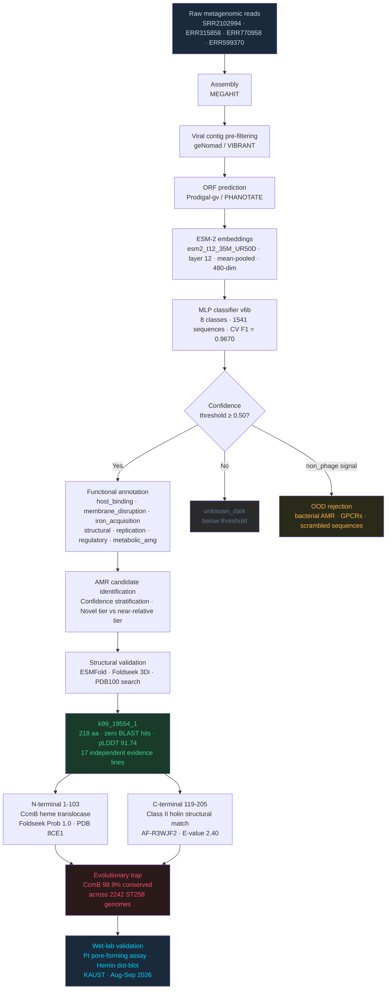

# PhageAMR-Finder

[](https://doi.org/10.5281/zenodo.20935067)
[](https://huggingface.co/spaces/Samerjahran/phage-dark-matter-annotator)
[](LICENSE)

**Mawhiba Ibdaa 2027 · Samer Ali Alghamdi**  
Al-Andalus International School, Jeddah, Saudi Arabia  
samerjahran@gmail.com

---

## What this project is about

The ocean is full of viruses we have never characterized. Most of their proteins return zero BLAST hits — no known relatives, no functional annotation, nothing. Standard tools skip them entirely.

This project uses ESM-2 protein language model embeddings to annotate those proteins without needing sequence similarity to anything previously described. Instead of asking whether a protein looks like something we have seen before, the model learns what functional classes look like in embedding space and can recognize them even when the sequence is completely novel.

The work started because one protein in Red Sea viral dark matter looked genuinely strange. It turned out to have two functional domains fused together in a way that, if it works the way the structural evidence suggests, creates a trap that drug-resistant *Klebsiella pneumoniae* ST258 cannot escape. That protein — k99_19554_1 — is what this project is built around.

**[Try the web tool →](https://huggingface.co/spaces/Samerjahran/phage-dark-matter-annotator)**

---

## Pipeline



---

## The core finding: k99_19554_1

k99_19554_1 is a 218 amino acid protein from an uncultivated Red Sea phage (metagenomic contig SRR2102994, KAUST expedition, 10m depth). It has zero BLAST hits in any global database at any e-value threshold.

Structural matching via Foldseek 3Di revealed two domains:

**N-terminal (residues 1–103) — CcmB heme translocase fold**  
Foldseek probability 1.00 against three independent experimental structures of the intact CcmABCD complex (PDB 8CE1, 7F02, 7VFJ). CcmB is part of the cytochrome c maturation pathway that *Klebsiella* ST258 depends on to survive under iron-limiting conditions in human serum. This locus is 98.9% conserved across 2,242 sequenced ST258 clinical genomes (Lan 2023). A direct structural match to CcmB from *K. pneumoniae* (AF-A0A377W2U0, Prob 1.00) was also confirmed in the N-terminal domain search.

**C-terminal (residues 119–205) — Class II holin structural features**  
Foldseek split-domain analysis returns AF-R3WJF2 from *Enterococcus phoeniculicola* (E-value 2.40) as the top non-CcmB hit. Isolated C-terminal fragment searches return CcmB-like folds due to shared multi-TM helical topology between CcmB and Class II holins, consistent with the chimeric nature of the fusion protein. Kyte-Doolittle sliding window analysis independently identifies two putative TM helices in the C-terminal domain.

**The evolutionary trap**  
If *Klebsiella* ST258 mutates away from CcmB, it loses cytochrome c maturation function and becomes iron-starved in human serum. If it retains CcmB, the holin domain can interact with the inner membrane during phage infection from inside the host cell. There is no single mutation that escapes both consequences simultaneously.

**Chimeric assembly validation (in progress)**  
Following reviewer feedback, we are rerunning SRR2102994 assembly with MetaSPAdes and IDBA in addition to MEGAHIT to confirm the fusion protein appears consistently across independent assemblers. Flanking ORF analysis on the parent contig is also underway to confirm phage affiliation. Results will be incorporated before final submission.

Seventeen independent evidence lines — structural, physicochemical, ecological, and computational — support this interpretation. Wet-lab validation is planned for August–September 2026 at KAUST.

---

## Classifier performance

| Metric | v6b (current deployed) |
|--------|----------------------|
| CV Macro F1 (5-fold, 1,541 sequences) | 0.9670 ± 0.0174 |
| OOD rejection — human GPCRs | 100% (3/3) |
| OOD rejection — bacterial AMR proteins | 100% (5/5) |
| OOD rejection — scrambled sequences | 100% (100/100) |
| Permutation test p-value | p < 0.0001 (n=10,000) |
| MMseqs2 leakage check (70% identity) | Zero overlap |

**8 functional classes:** host_binding, membrane_disruption, iron_acquisition, structural, replication, regulatory, metabolic_amg, non_phage

### Version history

| Version | Training sequences | CV Macro F1 | Key change |
|---------|-------------------|-------------|------------|
| v4 | 1,318 | 0.9771 ± 0.0091 | Baseline 8-class model, GPCR OOD rejection |
| v5 | 1,334 | 0.9761 ± 0.0062 | Added 16 bacterial AMR protein negatives |
| v6b | 1,541 | 0.9670 ± 0.0174 | Added scrambled sequences and diverse human protein negatives |
| v7 (experimental) | 1,340 | 0.9561 samples F1 | Multi-label MultiOutputClassifier — not deployed, 2/6 specificity |

### Known limitations

- ESM-2 mean-pooling collapses multi-TM protein embeddings. k99_19554_1 classifies as iron_acquisition rather than dual-label. Functional annotation rests on 17 Foldseek evidence lines, not the classifier output. Documented in Meier et al. 2021.
- Archaeal multi-TM proteins (e.g. bacteriorhodopsin) and some fungal cytoplasmic proteins show reduced specificity in v7 due to shared hydrophobic embedding signatures with phage structural proteins.
- The classifier class label "iron_acquisition" is an acknowledged imprecision for k99. The more accurate description is heme transport disruption via interference with the CcmB cytochrome c maturation pathway.

---

## Ecological finding

| Dataset | Ocean | Depth |
|---------|-------|-------|
| ERR315858 | Indian Ocean | 0 m |
| SRR2102994 | Red Sea | 10 m |
| ERR770958 | Atlantic Ocean | 200 m |
| ERR599370 | Pacific Ocean | 800 m |

The novel dark matter tier shows depth-invariant functional composition across all four datasets (Two-Way ANOVA, depth effect p > 0.05). The near-relative tier follows the published depth gradient in the same data. Since both tiers were processed through the same pipeline, the difference is biological, not methodological. The previously reported depth gradient in ocean virome functional composition appears to be driven entirely by near-homolog proteins rather than genuinely novel dark matter.

---

## Comparison to existing tools

| Tool | Approach | Handles zero-BLAST-hit proteins |
|------|----------|---------------------------------|
| Pharokka / PHROG | Sequence homology | No |
| Phold | Structural homology | Partial |
| Phynteny (Grigson et al. 2025) | Synteny + PHROG embeddings | No — requires annotated neighbors |
| **PhageAMR-Finder** | ESM-2 structural embeddings | Yes |

Phynteny independently validates the embedding-based approach (AUC > 0.84) but requires PHROG homology as input, meaning it fails on zero-BLAST-hit dark matter by the same mechanism as Pharokka.

---

## Repository structure

```
/
├── embed_and_predict.py
├── app.py                              (HuggingFace Gradio interface, v6b)
├── README.md
├── notebooks/
│   ├── PhageAMR_v4_train.ipynb
│   ├── PhageAMR_v5_retrain.ipynb
│   ├── PhageAMR_v6b_retrain.ipynb
│   └── PhageAMR_v7_multilabel.ipynb   (experimental)
├── models/
│   └── [classifier_v6b.pkl and label_encoder_v6b.pkl on HuggingFace]
└── data/
    └── [training sequences and embeddings on Zenodo]
```

---

## Citation

Alghamdi, S. A. (2026). PhageAMR-Finder: ESM-2 MLP Classifier for Ocean Phage Dark Matter Functional Annotation — Ibdaa 2027 (v2). Zenodo. https://doi.org/10.5281/zenodo.20935067

---

Grade 9 · Al-Andalus International School · Jeddah, Saudi Arabia  
Computational methodology reviewed by Prof. Robert Hoehndorf, King Abdullah University of Science and Technology (KAUST)
